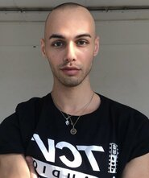

# 👋 Welcome! 👋

## Fabian Riess (he/him)

I'm a Berlin based artist and soon to be Web Developer.
My work as a dancer and choreographer has stretched all over Germany and Europe over the past 5 years.
Currently I'm a student at SPICED, getting ready to dance through the world wide web.

## My personal interests include:
- reading political theory
- going for walks without my phone
- travelling to remote places
- eating sugar

On the weekends you will usually find me [like this](https://giphy.com/embed/FBzqZGthkW6KQ)

  
  

<!--
**versacrvm/versacrvm** is a ✨ _special_ ✨ repository because its `README.md` (this file) appears on your GitHub profile.

Here are some ideas to get you started:

- 🔭 I’m currently working on ...
- 🌱 I’m currently learning ...
- 👯 I’m looking to collaborate on ...
- 🤔 I’m looking for help with ...
- 💬 Ask me about ...
- 📫 How to reach me: ...
- 😄 Pronouns: ...
- ⚡ Fun fact: ...
-->
